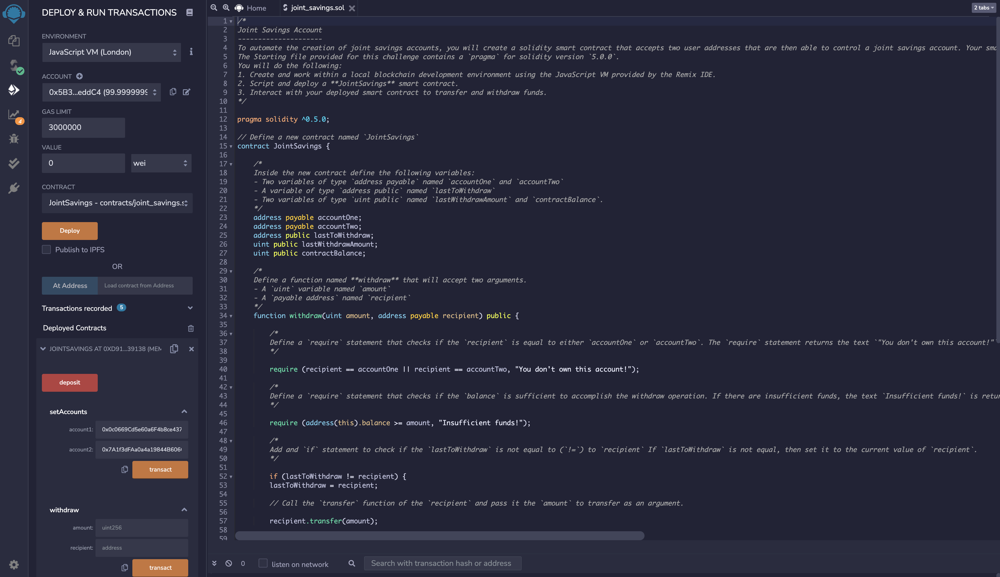

# Joint Savings Smart Contract
---

## Overview 
---
  This is a joint savings account smart contract that is written in solidity and uses ether management functions to implement a financial institution's requirement for providing the features of a savings acountm like the ability to deposit and withdraw funds from the account.
  
  

---

## Technologies

This project uses python 3.7 with the following packages:

* [Solidity docs](https://docs.soliditylang.org/en/v0.8.9/) - Solidity Docs

* [Solidity.io](https://www.solidity.io/?gclid=Cj0KCQjwtrSLBhCLARIsACh6RmiocRzYpaHolu8wtraKtChRBlbXSUn87QphQ28lX8FpkMq3buXdRnEaAu5hEALw_wcB) - Solidity.io

* [Ethereum Remix IDE](https://remix.ethereum.org) - Ethereum IDE

---

## Usage

To run application Joint_savings.sol, copy paste into Remix IDE~

## Resulting Transaction Images 
---

### Ethereum Remix IDE:

## Contributors

Brought to you by MartyCodes333 (martique.henton@gmail.com) with the help of 2021 UW FinTech Bootcamp Instructors, TA's and Fellow Classmates